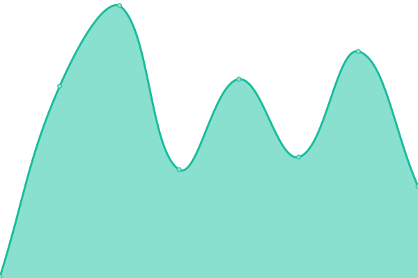
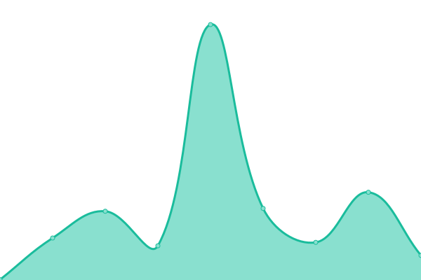

# [📈 Live Status](https://status.blimbing.xyz): <!--live status--> **🟥 Complete outage**

This repository contains the open-source uptime monitor and status page for [FahmiBahtiar](blimbing.xyz), powered by [Upptime](https://github.com/upptime/upptime).

With [Upptime](https://upptime.js.org), you can get your own unlimited and free uptime monitor and status page, powered entirely by a GitHub repository. We use [Issues](https://github.com/FahmiBahtiar/server-status/issues) as incident reports, [Actions](https://github.com/FahmiBahtiar/server-status/actions) as uptime monitors, and [Pages](https://status.blimbing.xyz) for the status page.

<!--start: status pages-->
<!-- This summary is generated by Upptime (https://github.com/upptime/upptime) -->
<!-- Do not edit this manually, your changes will be overwritten -->
<!-- prettier-ignore -->
| URL | Status | History | Response Time | Uptime |
| --- | ------ | ------- | ------------- | ------ |
|  [Blimbing Portofolio](https://blimbing.xyz) | 🟥 Down | [blimbing-portofolio.yml](https://github.com/FahmiBahtiar/server-status/commits/HEAD/history/blimbing-portofolio.yml) | 

 252ms
     
 | 

<a href="https://status.blimbing.xyz/history/blimbing-portofolio">99.97%</a>
    

|  [Code Market](https://codemarket.blimbing.xyz) | 🟥 Down | [code-market.yml](https://github.com/FahmiBahtiar/server-status/commits/HEAD/history/code-market.yml) | 

 817ms
     
 | 

<a href="https://status.blimbing.xyz/history/code-market">97.19%</a>
    

|  [Blog Blimbing](https://blog.blimbing.xyz) | 🟥 Down | [blog-blimbing.yml](https://github.com/FahmiBahtiar/server-status/commits/HEAD/history/blog-blimbing.yml) | 

 519ms
     
 | 

<a href="https://status.blimbing.xyz/history/blog-blimbing">99.45%</a>
    

|  [Code Market API](https://codemarket.blimbing.xyz/api/v1/products) | 🟥 Down | [code-market-api.yml](https://github.com/FahmiBahtiar/server-status/commits/HEAD/history/code-market-api.yml) | 

 2123ms
     
 | 

<a href="https://status.blimbing.xyz/history/code-market-api">99.53%</a>
    

<!--end: status pages-->

[**Visit our status website →**](https://status.blimbing.xyz)

## 📄 License

- Powered by: [Upptime](https://github.com/upptime/upptime)
- Code: [MIT](./LICENSE) © [Anand Chowdhary](https://anandchowdhary.com), supported by [Pabio](https://pabio.com)
- Data in the `./history` directory: [Open Database License](https://opendatacommons.org/licenses/odbl/1-0/)
